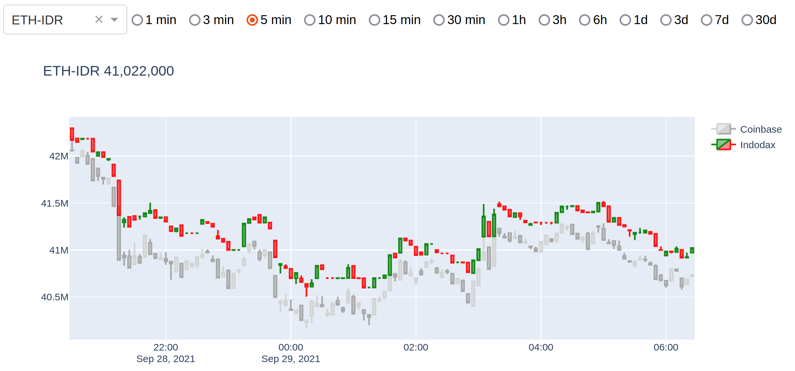

# Indodax and Coinbase Live Price

This small Python program polls live prices from Indodax and Coinbase and display them in a web page as a chart, updating the price every minute. I created this because I need a simple page where I can check the prices anytime and anywhere, e.g. from my mobile phone (you need to run the program in a desktop computer and be able to access it from your phone).  It displays both prices from Indodax and Coinbase so that you can compare the price movements in both exchanges.

Below is the screenshot.



## Installing

1. Install Python. Please follow [the instructions](https://www.python.org/downloads/) according to your operating system. I think you need at least version 3.7, but you can try version 3.5 or above if that's what you have (this absolutely needs version 3.5 or higher). This program was developed on version 3.8.
2. (Recommended) Install and create [virtual env](https://docs.python.org/3.7/library/venv.html)
3. Clone this repository:

   ```
   $ git glone https://github.com/bennylp/indodax-live-chart.git
   ```

4. Install the required Python packages:
   
   ```
   $ cd indodax-live-chart
   $ pip install -r requirements.txt
   ```
   
## Polling the price

Execute the following command and keep it running to keep polling for the latest price from Indodax and Coinbase every 1 minute:

```
$ python main.py poll
```

## Running the webserver

Execute the following command to run the webserver:

```
$ python main.py serve
```

## Viewing the price

Open your browser to [`localhost:8050`](http://localhost:8050) or <your_ip_address>:8050 to view it from the LAN or WLAN.


## Compacting the database

Once the program is running for many days, the live database can grow too big and slow down the chart display. Execute the following command to convert the old 1 minute data to lower frequency.

```
$ python main.py compact
```

## Updating historical price

We have two parquet data for the program, the "live" 1 minute data and historical data. The historical data is needed to display long term trend of the price and it has lower frequency (maybe daily or even every 3 days, depending on the exchange).

The repository should contain enough historical data, but if you need to update it (for example to add new coins to historical data), execute this command to update it:

```
$ python main.py hist
```

Note that only Coinbase provides historical data.

